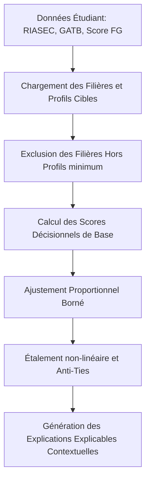

# Architecture du Moteur SIAEPI v6.0

Le système **SIAEPI v6.0** (Système d'Orientation Intelligent et d'Aide aux Étudiants) est un **moteur hybride décisionnel multicritère déterministe** (système expert) qui élimine les variations chaotiques au profit d'un pipeline d'aide à la décision mathématiquement stable, explicable et robuste.

---

## 1. Pipeline Décisionnel Déterministe

Le moteur fonctionne selon un flux d'exécution séquentiel, assurant la reproductibilité complète des recommandations pour un profil donné :

---

## 2. Formules et Modèle Multicritère

Le score final est le résultat d'un équilibre rigoureux réparti entre quatre dimensions clés (Pondérations rééquilibrées - Correction #3) :

$$Score_{Base} = 0.30 \cdot S_{Vocation} + 0.30 \cdot S_{Cognitif} + 0.25 \cdot S_{Proximite} + 0.15 \cdot S_{Marche}$$

### A. Match Vocationnel ($S_{Vocation}$ - 30%)
Combine la similarité cosinus et la distance euclidienne par rapport au vecteur RIASEC idéal de la filière en base de données, enrichi par l'adéquation par rapport aux dimensions psychométriques annexes (Big Five, Intérêts, Valeurs de Schwartz).

### B. Proximité Académique ($S_{Proximite}$ - 25% / Academic Distance Engine)
Évite le sous-classement (under-matching) en évaluant l'écart entre le Score FG de l'étudiant et le seuil historique SDO de la filière ($\Delta = Score_{FG} - SDO$) :

1. **Cas d'ambition** ($\Delta < 0$) : Décroissance logistique rapide de la probabilité d'admission :
   $$S_{Proximite} = \frac{1}{1 + e^{-0.18 \cdot \Delta}}$$
2. **Ciblage optimal** ($0 \le \Delta \le 15$) : Adéquation idéale entre potentiel et sélectivité :
   $$S_{Proximite} = 1.0$$
3. **Sécurité académique** ($15 < \Delta \le 35$) : Léger recul pour maintenir la filière accessible en cas de secours :
   $$S_{Proximite} = 0.95 - (\Delta - 15) \cdot 0.005$$
4. **Sous-classement** ($\Delta > 35$) : Pénalité progressive pour préserver le potentiel du candidat :
   $$S_{Proximite} = \max\left(0.40, 0.85 - (\Delta - 35) \cdot 0.012\right)$$

### C. Match Cognitif GATB ($S_{Cognitif}$ - 30%)
Compare le profil d'aptitudes de l'étudiant aux exigences réelles de la filière. Si l'étudiant présente un déficit critique (écart $> 15\%$) dans une aptitude exigée, une pénalité sélective et progressive est appliquée :
$$S_{Cognitif} = \max\left(0, \text{Match}_{GATB} - \text{Pénalités}\right)$$

### D. Match Marché ($S_{Marche}$ - 15%)
S'appuie sur le taux d'employabilité réel en Tunisie ($60\%$) et la croissance du secteur d'activité de la filière ($40\%$) issus de la taxonomie relationnelle.

---

## 3. Stabilité Algorithmique (Bounded Adjustments)

Pour éviter les sauts de classement imprévisibles, les interactions historiques et les retours (feedbacks) de l'étudiant ne modifient plus le score de base de façon multiplicative ou démesurée. Ils agissent à travers une couche d'ajustement additive strictement bornée :

$$Score_{Ajuste} = Score_{Base} \cdot (1.0 + \Delta_{Ajustement})$$
$$\text{avec } \Delta_{Ajustement} = \text{clip}\left(\text{Feedback} + \text{Interactions} - \text{Risque} - \text{Pénalités}, -0.15, 0.15\right)$$

Cette approche garantit qu'un profil excellent académiquement ne sera jamais déclassé arbitrairement par des critères secondaires, tout en permettant au système d'apprendre des préférences de l'utilisateur.

---

## 4. Différenciation des Recommandations (Stretching & Anti-Ties)

Afin d'éviter les égalités massives et de proposer une hiérarchisation lisible à l'étudiant, le top recommendations subit une transformation non-linéaire (puissance $1.3$) suivie d'un décalage de rang anti-égalité :

$$Score_{Contextuel} = \text{round}\left( \max\left(0.65, \min\left(0.98, S_{Stretched} - Rank \cdot 0.003\right)\right), 4 \right)$$

Cette méthode assure que le classement final présente des écarts cohérents tout en restant encadré de manière rigoureuse dans l'intervalle $[0.65, 0.98]$.

---

## 5. Taxonomie Structurée Centralisée

La taxonomie est entièrement stockée dans la base de données relationnelle MySQL, permettant au moteur de se passer de toute constante codée en dur.

- **Domaines** : Catégories majeures (ex. *Informatique & Numérique*).
- **Sous-domaines** : Sous-disciplines (ex. *Génie Logiciel & Applications*).
- **Spécialisations** : Orientations spécifiques (ex. *Développement Web & Mobile*).
- **Métiers associés** : Fiches métiers réelles avec fourchette salariale tunisienne, employabilité, et secteurs d'activité locaux.
- **Compétences clés** : Compétences dures et douces requises.
- **Profils de filières** : Exigences psychométriques et cognitives associées individuellement.
